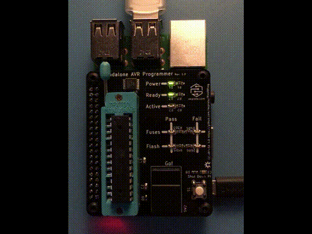

# PiAVRHat
Raspberry Pi based standalone ZIF Socket AVR Programmer

Program AVR chips with one click of a button:



Project Home Page: [https://www.eeproto.com/os/piavr](https://www.eeproto.com/os/piavr)

# Purpose

You designed a piece of hardware around an [AVR](https://en.wikipedia.org/wiki/AVR_microcontrollers) microcontroller, maybe the popular [ATmega328](https://www.microchip.com/wwwproducts/en/ATmega328). I love this powerful and inexpensive chip. Many projects use it, maybe because it is also the core of the even more popular [Arduino UNO](https://www.arduino.cc/en/Guide/ArduinoUno).

If you produce your new design two or three times, you flash your AVRs straight from your workstation. If you make 1,000, your distributor will gladly flash them for you. But what if you want, say, 50?

This project gives you all the parts to make a standalone, easy to use AVR programmer. It is Open Source, released under [Creative Commons Attribution-ShareAlike 4.0 International License](http://creativecommons.org/licenses/by-sa/4.0/), and it borrows from many other Open Source designs, including Sparkfun's [Pi AVR Programmer HAT](https://www.sparkfun.com/products/14747).

Hardware and software were tested with ATmega168 and ATmega328 chips. Feel free to adapt it to other AVR chips that support SPI programming.

# Make It

To make your own, get a Rasperry Pi. Any version should work, I tested it with a Pi 2 Model B v.1.1.

Make the custom PCB that connects the AVR socket, buttons, LEDs, etc. to the Pi.

Use the [KiCad](https://www.kicad-pcb.org/) project in the `hardware` folder to order your board. I got some from a low-cost PCB shop along with a stencil. It is a two-layer board with surface mount components on one side. There is a set of Gerber and drill files in the `hardware/plots` folder. The BOM in the same folder uses pretty generic components. The [octopart BOM](https://octopart.com/bom-tool/K1k6iRbx) might still be up.

Populate the surface mount components first. I use solder past, a stencil, tweezers, and a [ReflowR](http://www.reflowr.com/index.html) by [Lafras H](https://www.tindie.com/stores/LafrasH/). There are many other ways to do that, including hand soldering or reflowing with hot air like in this [EEVblog video](https://www.youtube.com/watch).

The 28 pin ZIF sockets can be a little hard to get, the major distributors might not have them in stock. Generic sockets through ama*** worked, too. Just make sure you get 28 pins in two rows with a 7.62mm / 0.3in row spacing.

If you don't feel comfortable with all of that, [email me](mailto:hello@eeproto.com), maybe I have some left over.

Add the through-hole parts. Double check you did not make any inadvertent solder bridges, then plug it in.

Support the PCB on top of your Pi with Nylon hex standoffs and secure everything with M3 screws.

Install the software by following the [Installation Guide](Installation.md).

# Prepare It

In order to program the AVR, you need two things:

1. A compiled HEX flash file.
2. The device configuration.

## 1. HEX file

Write and test your AVR firmware as usual. You can use [PlatformIO](https://platformio.org/), the [Arduino IDE](https://www.arduino.cc/en/Main/Software), a straight `avr-gcc` toolchain, or any other way. Build your project. 

Find the compiled HEX file. For Platform IO, look for a file `firmware.hex` in a folder `.pio/build/uno` underneath your project directory.

Copy this file to the root of a USB drive and name it `firmware.hex`. A standard FAT32 formatted drive works fine.

## 2. Device Configuration

Create a JSON file called `device.json` next to the HEX file on the USB drive. You can use the file from the `samples` folder as a starting point.

Adjust the AVR fuse settings to your needs. Here are a few samples:

| Fuses  | Settings |
|---|---|
| (E:FF, H:D9, L:E2) |Internal 8 MHz oscillator|
| (E:FF, H:D9, L:62) |Internal 1 MHz oscillator|
| (E:FD, H:DE, L:FF) | External 16 MHz crystal|
| (E:FD, H:DE, L:FF) | default Arduino UNO settings |

Set the chip type so avrdude knows what signature to expect. Common types:

|Type|Signature|
|---|---|
|atmega168|1e9406|
|atmega168p|1e940b|
|atmega168pb|1e9415|
|atmega328|1e9514|
|atmega328p|1e950f|
|atmega328pb|1e9516|

Check this [post](https://www.avrfreaks.net/forum/device-signatures) for a full list.

Example configuration file:
```json device.json
{
  "E": "FF",
  "H": "D9",
  "L": "E2",
  "type": "atmega328p"
}
```

# Use It

1. [Assemble](#make-it) the hardware and [install](Installation.md) the Pi firmware.
1. [Prepare](#prepare-it) the USB flash drive with your hex file and device configuration.
1. Power the Pi.
1. You should see the `Power` LED turn on.
1. The `Ready` LED is flashing until a USB drive with a valid device configuration and hex file is plugged in. Plug it in and wait for the `Ready` LED to turn solid green.
1. Insert an AVR chip that matches your device configuration into the ZIF socket and lock the socket. The index notch is at the top next to the title print.
1. Press the `Go!` button.
1. The `Active` LED turns on.
1. If the device needs updated fuse settings, the `Fuses Pass` LED should go green after a moment.
1. The `Flash Pass` LED goes green once flashing was successful.
1. If at any time a `Fail` LED starts flashing, the programmer was unsuccessful communicating with the AVR chip. Check everything is wired correctly and the AVR is secure in its place with Pin 1 at the top. Try a different AVR chip. If this problem continues to exist, try reducing the programming bitclock in the Python script. 

# How It Works

The Pi runs a small Linux OS based on PipaOS. On boot, it starts a Python script as a background system service.

This script reads the USB drive, looking for both a flash HEX file and a device configuration JSON file. 

If both are there, the script starts monitoring the big pushbutton labeled `Go!`.

When you press the button, the script runs avrdude to first check the device signature. Then, it reads the fuses. If they need to be programmed, it does that. Last, it writes the HEX file contents to the AVR flash memory.

Looking at the output of the avrdude commands, the script lights the LEDs to tell you what worked and what did not.

You can pull power from the Pi without shutting it down, because PipaOS allows the SD card to be mounted read-only.

The custom PCB mainly connects the SPI lines provided by the Pi to the AVR. A 4066 isolates the two chips when not programming, as the AVR might go into SPI master mode after releasing the RESET line. One momentary push button with a little ESD protection starts the programming, another one allows a clean shutdown of the Pi, in case you decide to run with a different OS setup.

To connect the AVR, you can use any standard socket, although a ZIF socket allows for frustration free insert and removal.

Although it looks like a HAT, technically this is not a HAT according to the [HAT Design Guide](https://github.com/raspberrypi/hats/blob/master/designguide.md). It still fits nicely on top of the Pi.

# Known Issues

For reasons I don't know, my prototype assemblies would only flash at a bitrate of around 200 kHz. A dirty breadboard assembly ran up to 2MHz. Need to figure out why that is.

# Credits

This project depends heavily on other people's great open source work, including:

- The [PipaOS](http://pipaos.mitako.eu/) Linux distribution by Albert Casals
- [avrdude](http://savannah.nongnu.org/projects/avrdude/) AVR programmer
- Kevin's [linuxspi](http://kevincuzner.com/2013/05/27/raspberry-pi-as-an-avr-programmer/) extension for avrdude
- Steve's [programmer design](https://blog.stevemarple.co.uk/2012/07/avrarduino-isp-programmer-using.html) with 74LVC244 isolating buffers
- adafruit's [linuxgpio-based design](https://learn.adafruit.com/program-an-avr-or-arduino-using-raspberry-pi-gpio-pins?view=all)
- Mark Williams shows how to operate the Pi [with the Arduino IDE](http://ozzmaker.com/program-avr-using-raspberry-pi-gpio/)
- QCPete's [writeup](https://learn.sparkfun.com/tutorials/raspberry-pi-stand-alone-programmer/all) on the design of the [Pi AVR Programmer HAT](https://www.sparkfun.com/products/14747)
- Volker Urban's [Pi/AVR summary](https://www.mikrocontroller.net/articles/Raspberry_Pi_als_Universalprogrammer) (german)
- [KiCad](https://www.kicad-pcb.org/), an exceptional and Open Source electronics design software
- Chris Gammell's [Contextual Electronics Forum](https://forum.contextualelectronics.com/) as an endless source of great knowledge.
